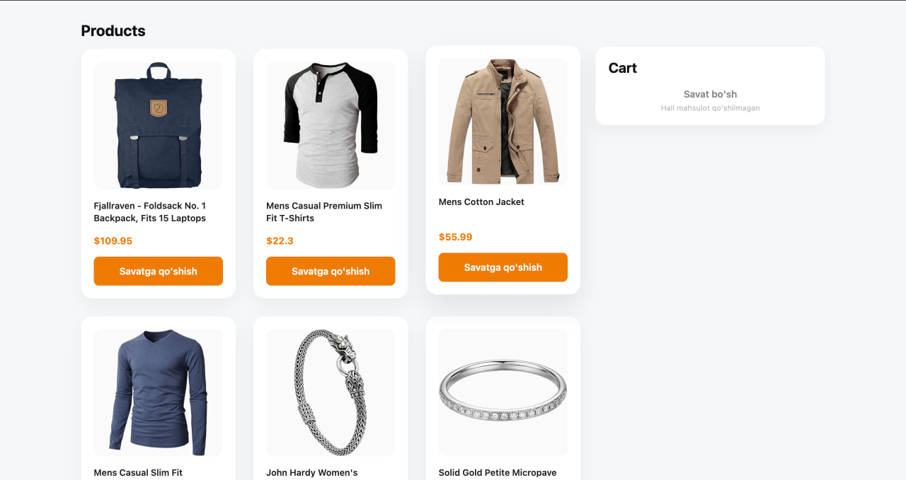
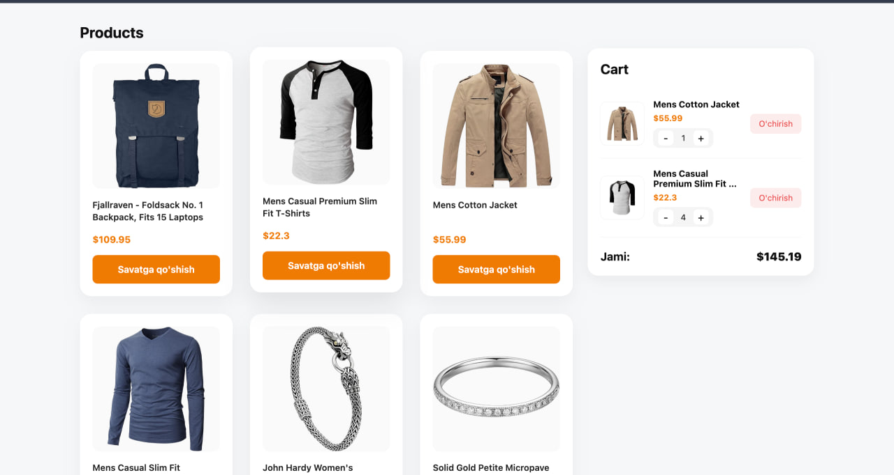
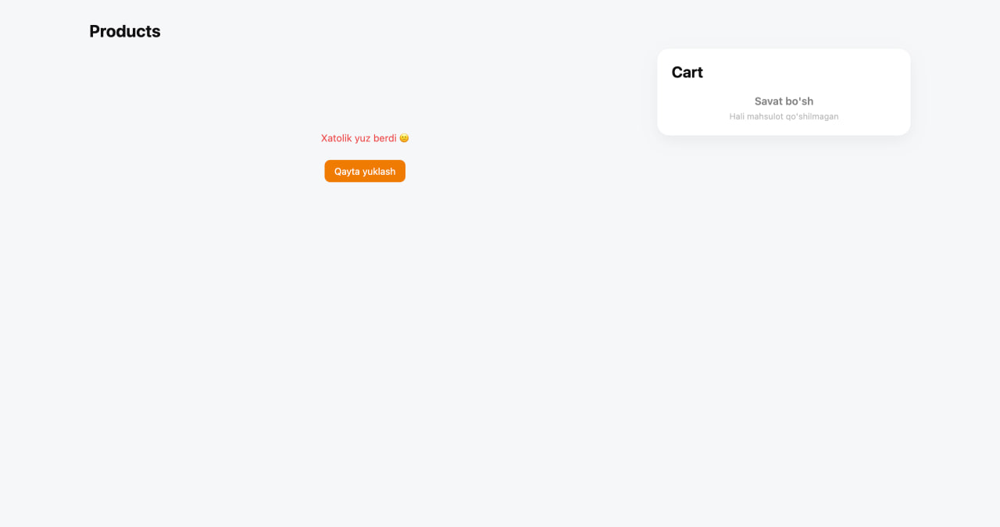

# 🛒 Mini E-Commerce Project

Bu loyiha Next.js yordamida yaratilgan mini marketplace bo'lib, mahsulotlar roʻyxati, savatcha (cart) funksiyasi va oddiy UI elementlarini o‘z ichiga oladi.

---

## 👤 **Ism**
Javohir Yusupov

---

## ⏳ **Vazifa qancha vaqt oldi**
Bu mini e-commerce loyihani to‘liq tayyorlashga taxminan 3:40 soat vaqt sarflandi.  
- **🔹 40 daqiqa — UI dizayn**
  Asosiy sahifalar uchun minimal, sodda va qulay interfeys konsepti ishlab chiqildi.

- **🔹 3 soat — To‘liq website ishlab chiqish**
  Bosh sahifa, mahsulotlar ro‘yxati, savatcha (cart) funksiyasi, localStorage bilan sinxronlash, modal oynalar, buyurtma tasdiqlash sahifasi va deploy jarayonlari yakunlandi.
---

## ⚠️ **Qiyin bo‘lgan joylar**
- Cart ma’lumotlarini `localStorage` bilan to‘g‘ri sinxronlash  
- Component mount bo‘lganidan keyin holatlarni yangilash

---

## 🖼️ **Interfeys skrinshotlari**

 

## 🔗 Demo havolasi
[Mini Marketplace — Live Demo](https://mini-marketplace-new.vercel.app/)